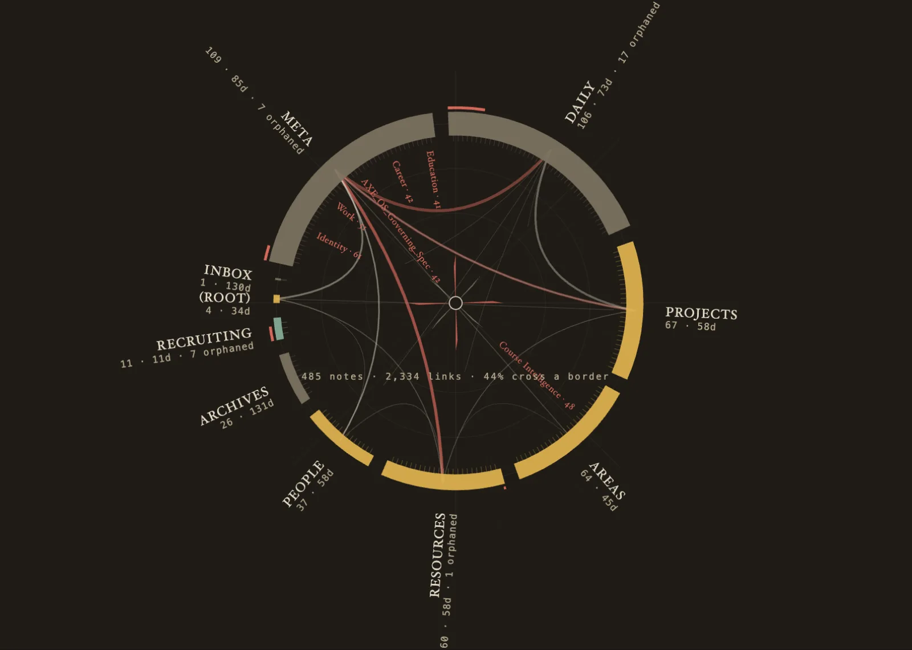

# chart-corpus

**Live chart: [{{PORTFOLIO_URL}}/demos/carta/]({{PORTFOLIO_URL}}/demos/carta/)**

Draws a set of linked notes as a medieval portolan sea chart. I use it on my
Obsidian vault, my second brain, and a scheduled job redraws it every Sunday
morning as *Carta del Cervello*.



## Reading the chart

| Chart element | Data |
|---|---|
| A stretch of coast | one top-level vault folder, its length set by its note count |
| Wash (verdigris, ochre, grey) | median days since the folder's notes were last committed |
| Vermilion tick on the seaward side | the share of the folder's notes that nothing links to |
| Rhumb line across the sea | links crossing between two folders (drawn at 4 or more) |
| Named port | a note with 30 or more backlinks |

A gazetteer under the chart lists every territory with its notes, age and
orphans in plain numbers.

## Measuring age honestly

This was the hard part. File modification dates were useless, because they were
all rewritten when the vault moved off iCloud, so a chart drawn from them showed
a vault with no stale corner anywhere. Frontmatter dates cover only about 85% of
notes, unevenly by folder. So the script reads each note's age from git history.
Git only goes back to the day the repository was created, so the chart labels
every age as a minimum and counts the notes sitting at that limit.

Links come from Obsidian's own resolved link graph over the Local REST API,
because searching text for `[[brackets]]` misses aliases and heading links and
invents links that do not resolve.

## Run it

Needs Obsidian running with the community
[Local REST API](https://github.com/coddingtonbear/obsidian-local-rest-api)
plugin enabled; the script reads the plugin's key from the vault itself. The
vault must be a git repository.

```bash
/usr/bin/python3 scripts/redraw.py --vault ~/path/to/vault --out carta.html
```

Standard-library Python only. The output is one self-contained HTML file with no
outside dependencies, themed for light and dark. About four seconds over a few
hundred notes, with the note fetches spread over twelve threads.

To chart something other than an Obsidian vault, replace `fetch_graph()` and
`git_last_touched()` in `scripts/redraw.py` and keep everything downstream; the
contract is in [SKILL.md](SKILL.md).

Joseph Blumberg · josephblumberg325@gmail.com
